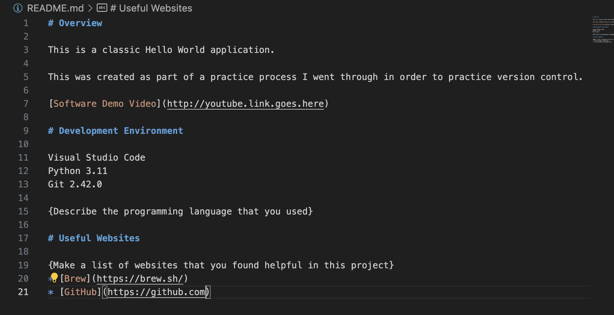

# Overview

This is a classic Hello World application.

This was created as part of a practice process I went through in order to practice version control.

[Software Demo Video](http://youtube.link.goes.here)

# Development Environment

Visual Studio Code
Python 3.11
Git 2.42.0

I used python 3 for this application.

# Useful Websites

* [Brew](https://brew.sh/)
* [GitHub](https://github.com)